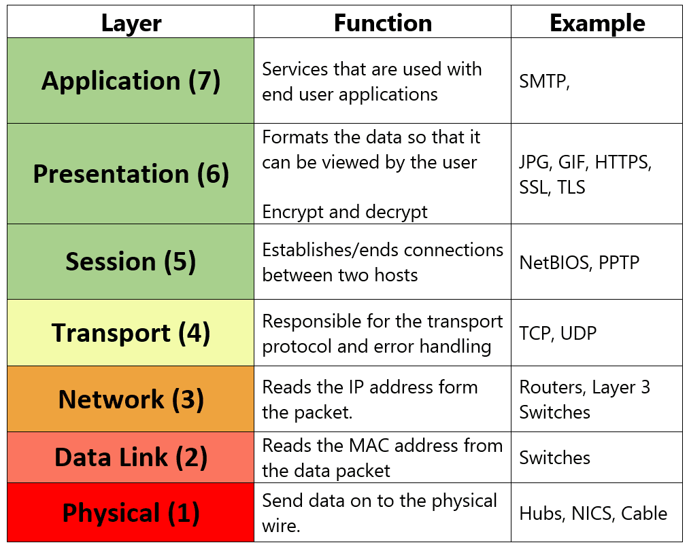
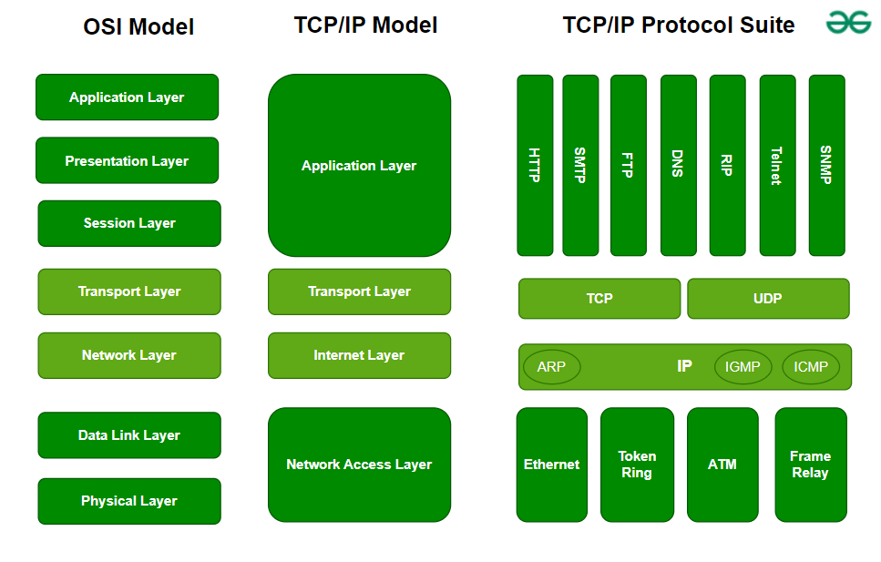

[back to previous page](./networking-content.md)

--- 

## OSI Model : 

- A conceptual framework that divides network communication into seven layers, each with specific functions and protocols. It helps standardize communication, improve interoperability, and simplify network design and troubleshooting.

### How the OSI Model Works

- **Encapsulation and Decapsulation**: As data travels down from the Application Layer to the Physical Layer, each layer adds its own header (encapsulation). When data travels up from the Physical Layer to the Application Layer, each layer removes its corresponding header (decapsulation).
- **Layer Interaction**: Each layer communicates with the layer directly above and below it. For instance, the Transport Layer interacts with the Network Layer below and the Session Layer above.

### Layers in OSI Model : 

1. **Physical Layer**
   - Function: Transmits raw bit streams over a physical medium.
   - Details: Deals with the hardware elements such as cables, switches, and network interface cards. It defines the electrical, mechanical, and procedural specifications for network communication.
   - Protocols/Standards: Ethernet (IEEE 802.3), USB, Bluetooth, RS-232.

2. **Data Link Layer**
   - Function: Provides node-to-node data transfer, error detection, and correction.
   - Details: Ensures reliable transmission of data across the physical link by creating and managing frames. It is divided into two sublayers:
      - MAC (Media Access Control): Controls how devices on the network gain access to the medium and permission to transmit data.
      - LLC (Logical Link Control): Manages frame synchronization, flow control, and error checking.
   - Protocols/Standards: Ethernet (IEEE 802.3), PPP (Point-to-Point Protocol), HDLC (High-Level Data Link Control), ARP (Address Resolution Protocol).

3. **Network Layer**
   - Function: Handles the routing of data (packets) from source to destination across multiple networks.
   - Details: Manages logical addressing, routing, and packet forwarding. It determines the best path for data transmission.
   - Protocols/Standards: IP (Internet Protocol), ICMP (Internet Control Message Protocol), RIP (Routing Information Protocol), OSPF (Open Shortest Path First).

4. **Transport Layer**
   - Function: Ensures reliable data transfer between end systems.
   - Details: Provides end-to-end communication services for applications. It includes error detection and recovery, data flow control, and segmentation/reassembly of packets.
   - Protocols/Standards: TCP (Transmission Control Protocol), UDP (User Datagram Protocol), SCTP (Stream Control Transmission Protocol).

5. **Session Layer**
   - Function: Manages sessions between applications.
   - Details: Establishes, maintains, and terminates communication sessions. It provides synchronization, dialog control, and manages data exchange between networked services.
   - Protocols/Standards: NetBIOS, PPTP (Point-to-Point Tunneling Protocol), RPC (Remote Procedure Call).

6. **Presentation Layer**
   - Function: Translates data between the application layer and the network.
   - Details: Ensures that data is in a usable format and translates between different data formats and encryption. It handles data encryption, decryption, compression, and encoding.
   - Protocols/Standards: SSL/TLS (Secure Sockets Layer/Transport Layer Security), JPEG, GIF, MPEG, ASCII, EBCDIC.

7. **Application Layer**
   - Function: Provides network services directly to end-user applications.
   - Details: Interfaces directly with user applications to provide functions such as email, file transfer, and web browsing. It supports network processes and service requests.
   - Protocols/Standards: HTTP/HTTPS (HyperText Transfer Protocol/Secure), FTP (File Transfer Protocol), SMTP (Simple Mail Transfer Protocol), DNS (Domain Name System), SNMP (Simple Network Management Protocol).

   