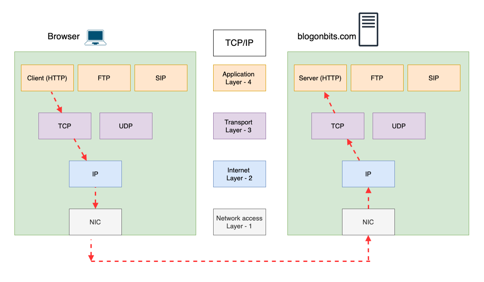
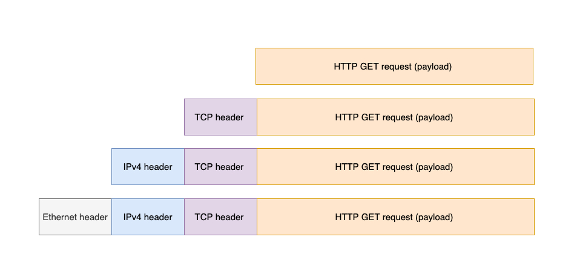

[back to previous page](./networking-content.md)

--- 

## TCP-IP 

### Overview of TCP/IP model : 

The TCP/IP model is structured into four layers, each with specific functions and protocols:
1. Application Layer: This layer provides protocols that support network applications and end-user services. It interacts directly with software applications to implement a communicating component.
2. Transport Layer: It ensures reliable data transmission between devices. The main protocols here are TCP and UDP.
3. Internet Layer: This layer handles logical addressing, routing, and packet forwarding. The primary protocol is IP.
4. Network Interface Layer (Link Layer): This layer covers protocols related to hardware addressing and the actual physical transmission of data over networks.

### How TCP/IP Works Together : 

- Data Encapsulation: Data from an application is encapsulated with the necessary headers as it moves down each layer.
   - At the Application Layer, data is prepared for transmission.
   - At the Transport Layer, it's encapsulated with TCP or UDP headers.
   - At the Internet Layer, it's encapsulated with an IP header.
   - At the Network Interface Layer, it's encapsulated with a frame header.

- Routing and Forwarding: Routers at the Internet Layer read IP headers to forward packets to their destination, based on the information in te headers.
- Decapsulation: At the destination, data is decapsulated as it moves up the layers, till the original payload reaches the final application/server on the receiver/server side.

### 1. Application Layer : 

Application Layer includes protocols for specific data communications services on process-to-process levels across an IP network:

- HTTP/HTTPS: Used for web browsing.
- FTP: File Transfer Protocol for transferring files.
- SMTP: Simple Mail Transfer Protocol for email transmission.
- IMAP/POP3: Email retrieval protocols.
- DNS: Domain Name System for translating domain names to IP addresses.

### 2. Transport Layer : 

Transport Layer provides end-to-end communication services for applications. It ensures that data is transferred reliably and without errors.

- TCP (Transmission Control Protocol):
   - Connection-Oriented: Establishes a connection before transmitting data.
   Reliable: Guarantees the delivery of data packets in the same order they were sent.
   - Flow Control: Manages data flow to prevent congestion.
   - Error Control: Checks for errors in data and retransmits if necessary.

- UDP (User Datagram Protocol):
   - Connectionless: No need to establish a connection before sending data.
   - Unreliable: No guarantees for delivery or order of data packets.
   - Low Overhead: Faster but less reliable than TCP.
   - Used in applications where speed is critical, such as live streaming.

### 3. Internet Layer : 

Internet Layer is responsible for logical addressing, routing, and packet forwarding.

- IP (Internet Protocol):
   - IPv4: Uses 32-bit addresses, providing about 4.3 billion unique addresses.
   - IPv6: Uses 128-bit addresses, providing a virtually unlimited number of addresses.
   - Handles packet fragmentation and reassembly.
- ICMP (Internet Control Message Protocol):Used for error reporting and diagnostic functions (e.g., ping and traceroute).
- ARP (Address Resolution Protocol): Maps IP addresses to MAC (Media Access Control) addresses.
- RARP (Reverse Address Resolution Protocol): Maps MAC addresses to IP addresses.

### 4. Network Interface Layer / Link Layer : 

Network Interface Layer handles hardware addressing and the physical transmission of data.
- Ethernet: Common protocol for wired local area networks (LANs).
- Wi-Fi (IEEE 802.11): Common protocol for wireless networks.
- PPP (Point-to-Point Protocol): Used for direct communication between two network nodes.