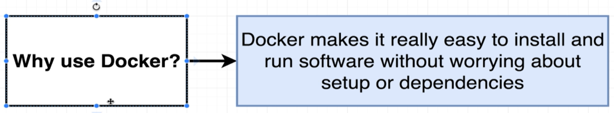
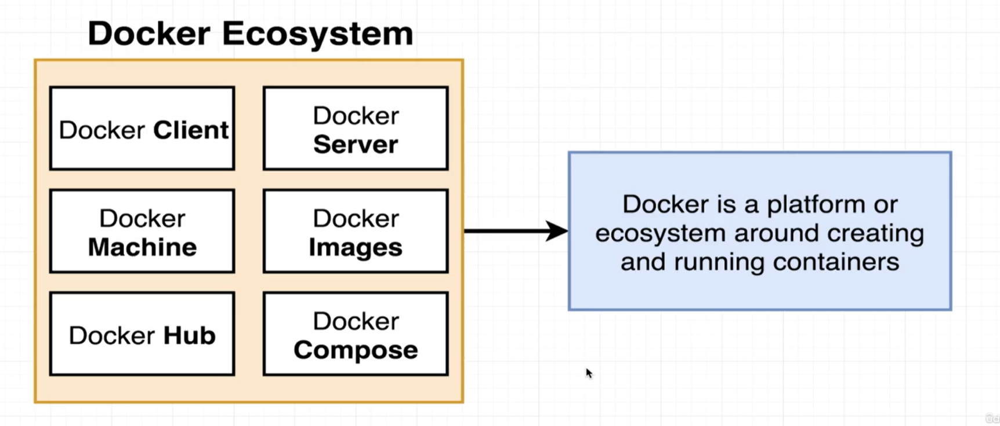
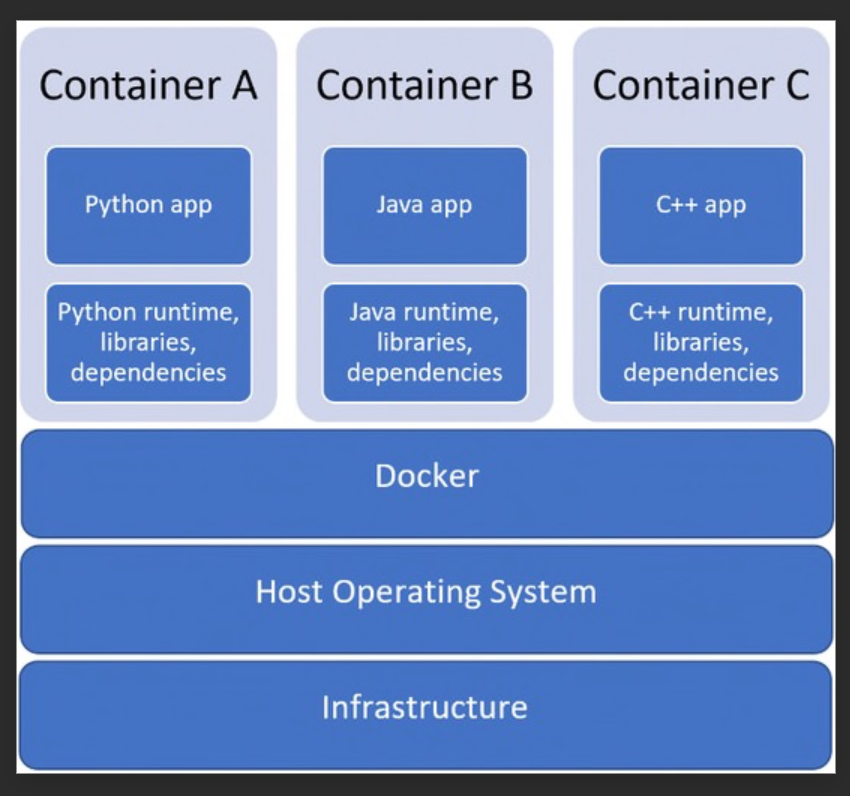

# Docker topics:

-**Why Use DOCKER?**
-one of the reasons to use Docker is to make installation fo software packages easy 

-**What is DOCKER?**
-its a platofrm for managing contianer (creating anf running them)

-**what is a CONTAINER?**
-A Docker container is a lightweight, standalone, executable package of software that includes everything needed to run an application: code, runtime, system tools, system libraries, and settings. It packages an application and its dependencies together, making it easier to create, deploy, and run applications
