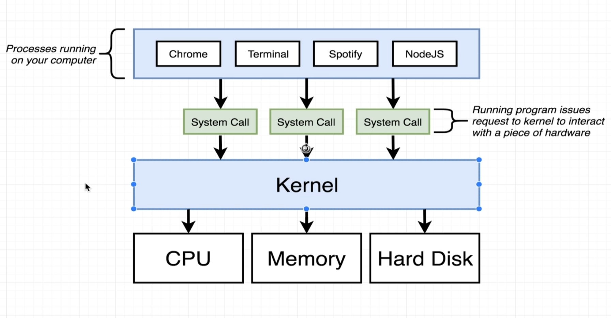
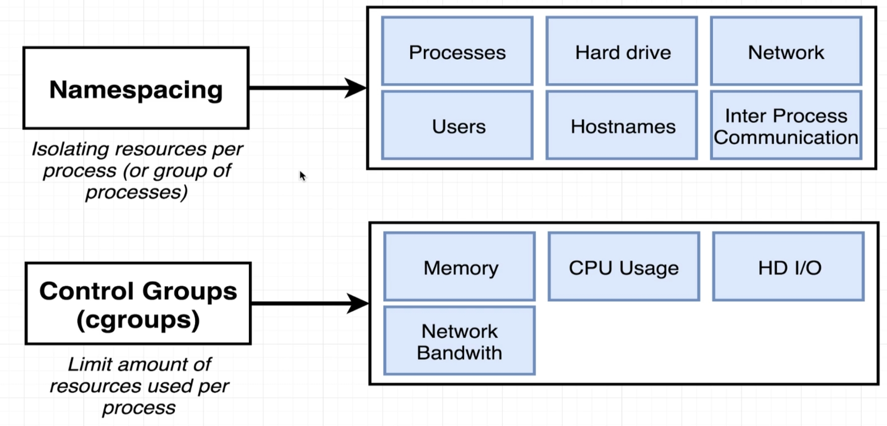
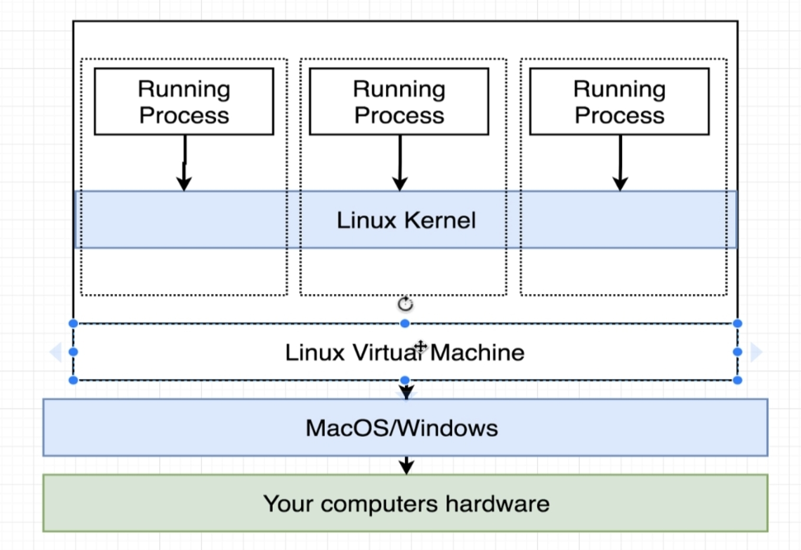
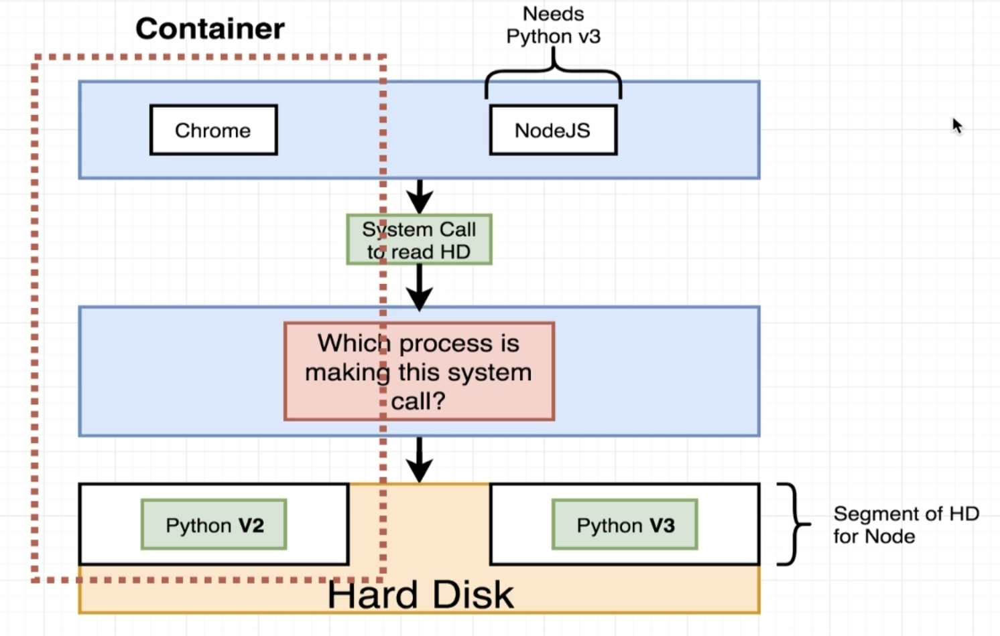
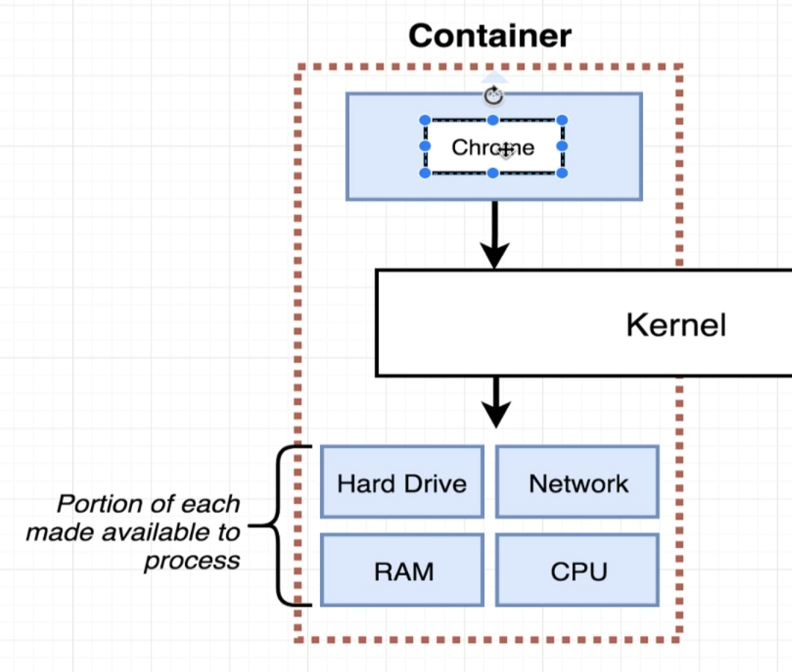
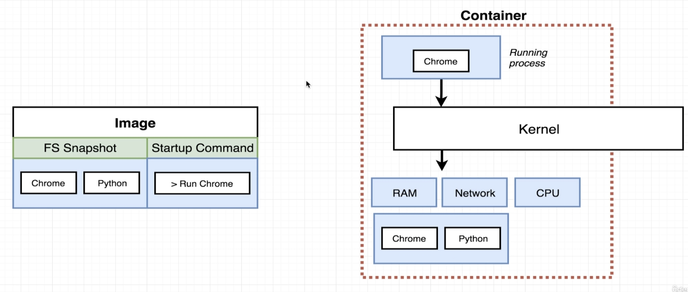

# Container

- **how your OS works**\

- OS **Kernel** is a software proces that governs the access of all the processes running on your computer and the hardware.
- **System call** are the kernel's exposed end points that the applications call to interact with the kernel

--- 
---
---
- ### Why Containers are better for development?

assume that in  a hypothetical situation : software A needs python V2 and B needs Python V3 to run\
another limitation : you can only have instance of python at a time\
possible solutions for this :
1. **NameSpacing** feature of the OS (divide the hardware into 2 namespaces and install different python Versions on each) - provide A access to the segment to the one with V2 and B to the one with V3, kernel can manage the segment access based on the system call by A or B

**Namespace** not just limited to hardware division\
**Control group** is another concept for limiting resources per process
- these 2 concepts are LINUX specific : how does then Docker work on other OS -> LINUX Virtual Machine
- when you install Docker Desktop on some other OS -> it installs LINUX VM as well ans uses that as another layer of abstraction of top of the host OS to mimic LINUX environment 

2. **Container** : a container has access to a set/group of resources assigned to that process (not a physical contruct)

an morte simplied and general representation of a container would be : 

---
---
---

- ### What happens behind the scenes when we create a container from an Image?
Image contains:
1. File System Snapshot : info about a set of required directories, tools
2. Startup Command : self explanatory

once you try to execute the image : 
1. Kernel isolated the resources for the Container
2. The tools in the FS snapshot are then installed in the seciton of hardware
3. startup command then gets executed and starts the required process
