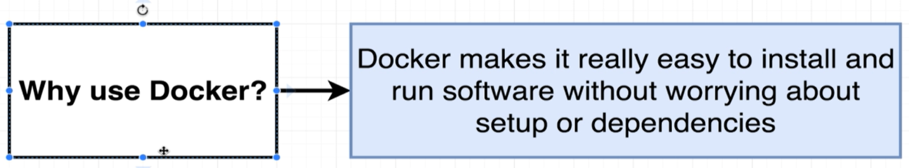
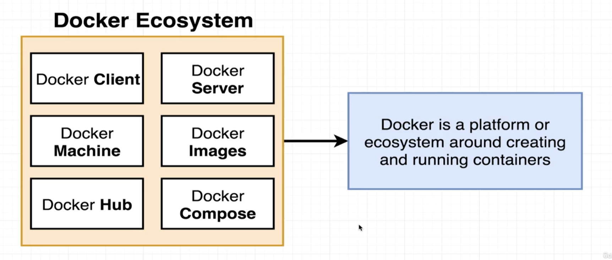
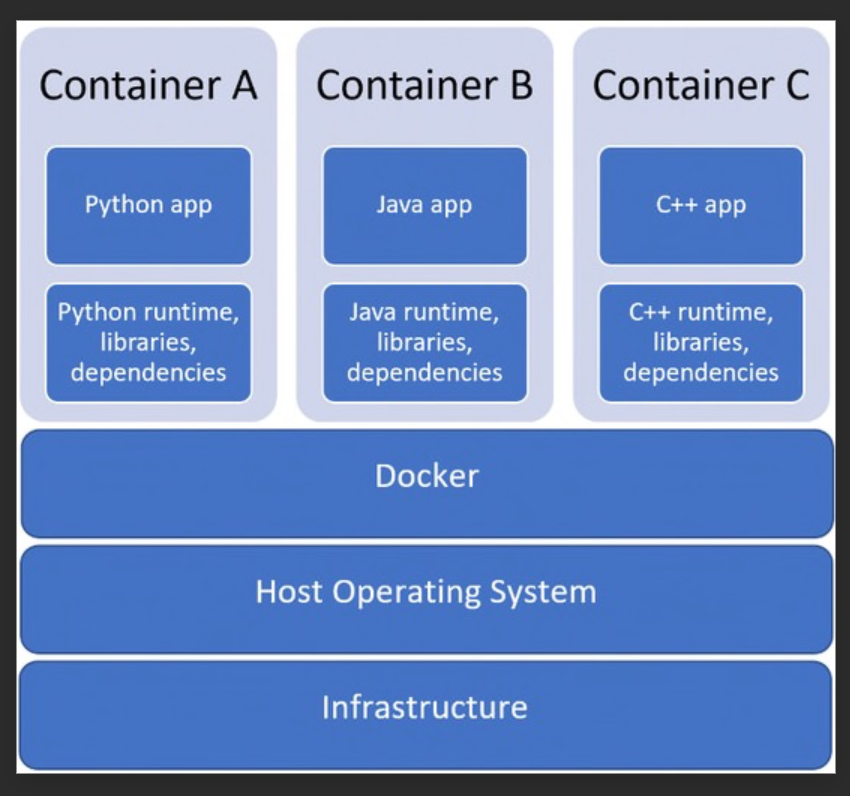
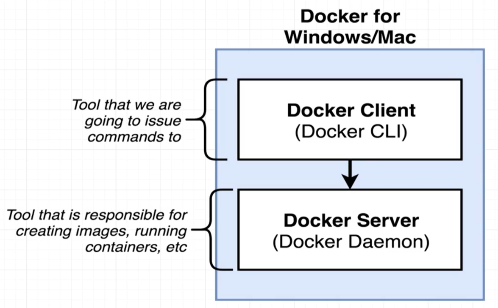

[back to previous file](../dockercontent.md)
---

-**Why Use DOCKER?**\
one of the reasons to use Docker is to make installation fo software packages easy 

-**What is DOCKER?**\
its a platofrm for managing contianer (creating & running them)

---

-**what is a CONTAINER?**\
A Docker container is a lightweight, standalone, executable package of software that includes everything needed to run an application: code, runtime, system tools, system libraries, and settings. It packages an application and its dependencies together, making it easier to create, deploy, and run applications

-**What is an IMAGE?**\
Single file with all the dependencies and Configuration required for running an application
Container is an instance of image

-**What is Docker desktop?**\
Docker as technology can only be run on Linux OS\
Docker Desktop does 2 things.
- creates Linux VM on your host OS (Windows / Mac)
- forwards docker-cli commands from the host OS to created Linux VM 
- due to this the containers are created on Linux VM, and on the surface it appears to be working on Windows/Mac\

Thus we are able to run and use docker-cli on Windows/Mac even though these OS's do not support docker images/containers.

the docker desktop is a bundle of the Docker CLI and Docker server/Daemon in a single application\
we interact with with the CLI -> CLI interacts with the Daemon
