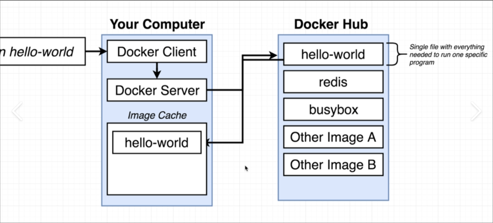

# what happens when you run a docker command : flow 


when you try to run your first command in docker CLI\
```dokcer run hello-world```\
the flow behind this is : 

1. Docker CLI(client) contacted Docker daemon(server)
2. Daemon checked if the local image cache contains relevant image 
3. if not a new image is pulled from docker hub
4. Container created using the image and executed



