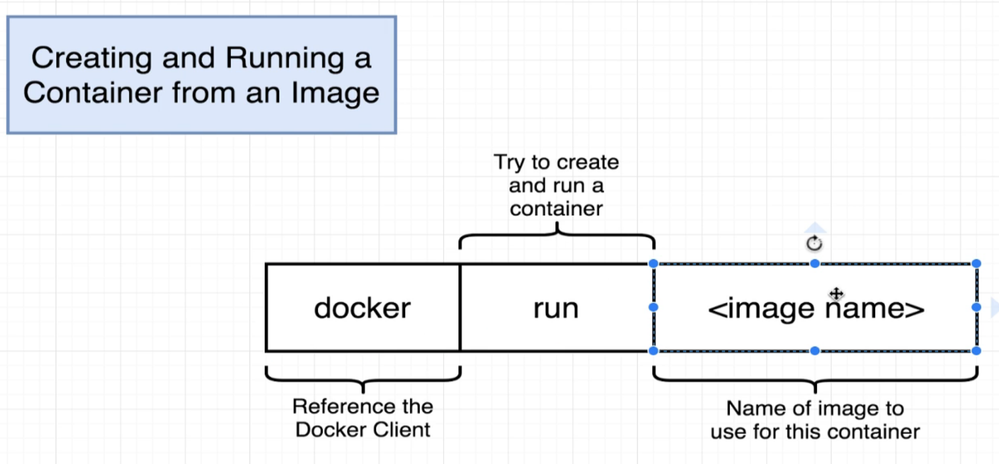
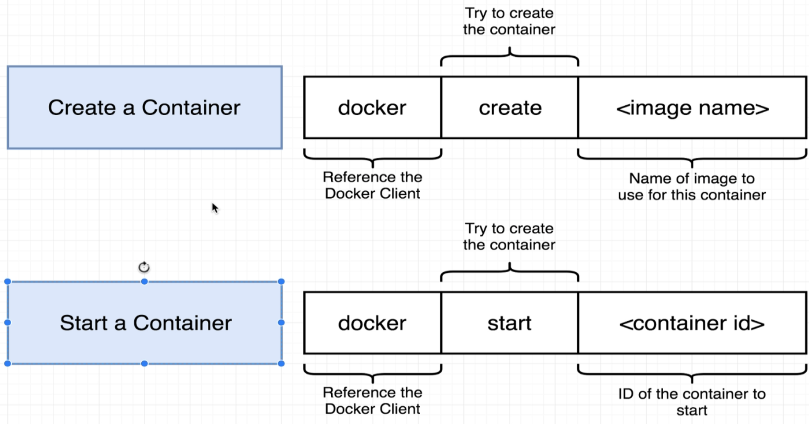
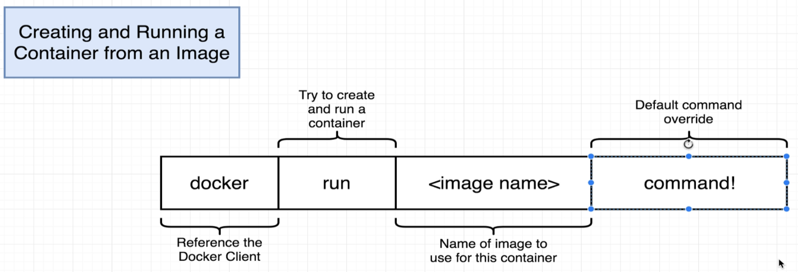
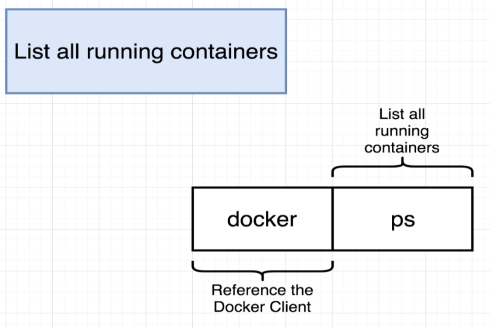
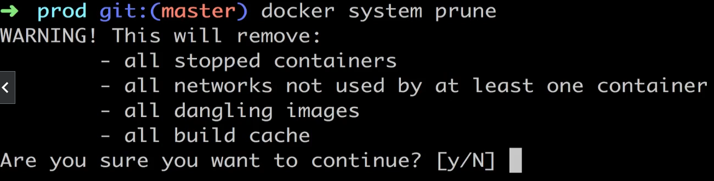
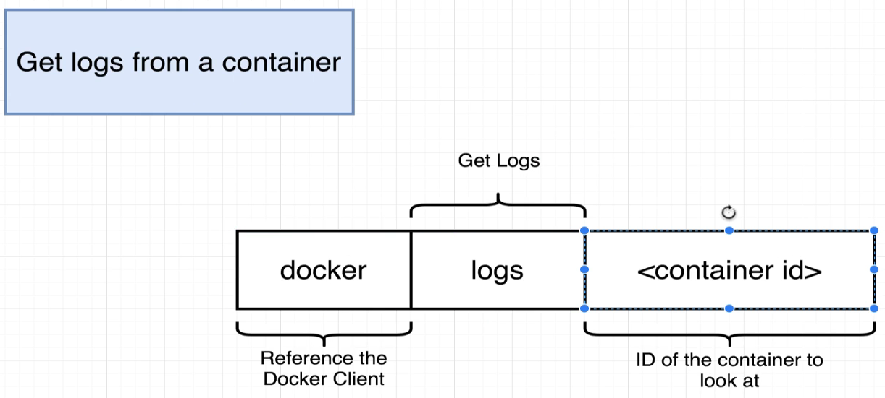
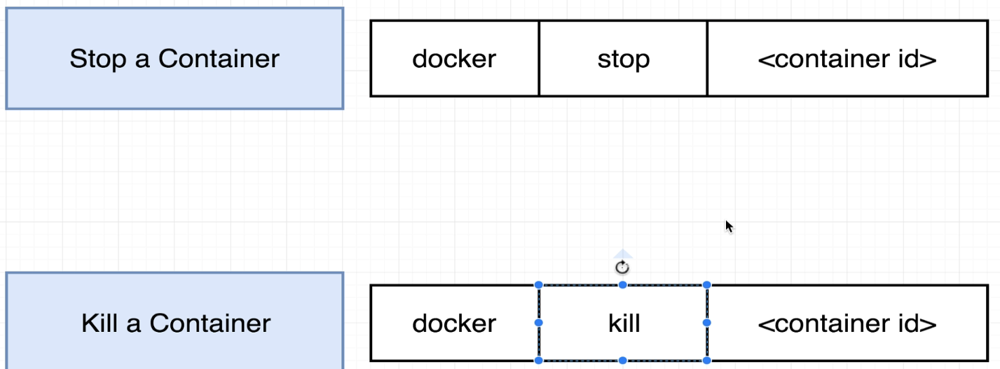
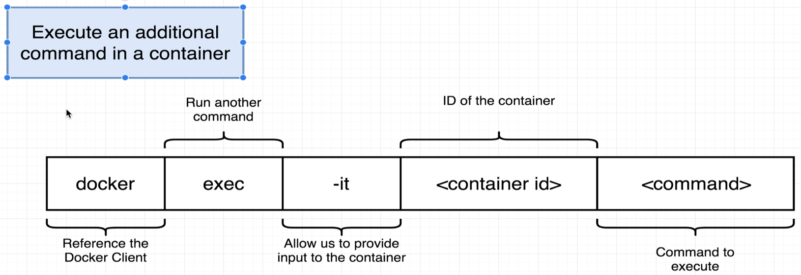
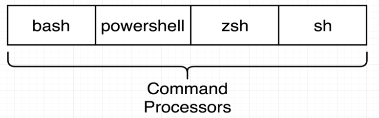

[back to previous file](../dockercontent.md)
---
# basic commands getting started with Docker

### 1. Creating and running a container from an Image
`docker run <image_name>`

- this `docker run` command is composed of two different commands:
- `docker create <image_name>` : create a container from image - outputs the container_ID
- `docker start -a <cotainer_id` : run/execute the container already created, **-a flag makes docker attach to that running container and watch for output**\

---

### 2. overwrite the default startup command in the Image
`docker run <image_name> <command instead of default one>`\
for this to run successfully the image should have the command executables in its FS snapshot, ls/echo... commands have executables that do the work once these commands run\

- you can do the same thing with the `docker create <image_name>` command
- However once a container is created with/without default command -> you can not modify it 

---

### 3. List all **running containers**
`docker ps`\

- `docker ps --all` -> will list all the containers we have created till now **(not just the currently ones)**

---

### 4. Clear everything in local 
`docker system prune` command clears : 
1. build cache - you'll have to download recently use images again
2. dangling images - images stored on local
3. clear stopped containers - nothing will dhow up on the `docker ps --all` command
4. all network in use by any containers 

---

### 5. get LOGS from containers 
`docker logs <container_ID>` command lets you get all the output logs that container generated while it executed till the timestamp of the command execution

- this is a sort of hack if you have a process inside a container that taked a while to complete and started the container without the **-a flag**

---

### 6. Stopping containers
`docker stop <container_ID>` OR `docker kill <container_ID>`

- stop sends a SIGTERM (terminate signal) call to the primary process in the coantiner - meaning you should stop now and allowed to do some cleanup
- kill sends a SIGKILL (kill signal) call to the primary process in the container - meaning you have to STOP RIGHT NOW, no cleanup allowed

- **if the docker stop does not get the work done in 10secs -> it runs the kill command to get the job done behind the scenes**

---

### 7. executing commands inside a running container 

- scenario : you run a DB inside a container and need to use that -> you'll need to use the DB's CLI (usually bundled in a single package)
- to be able to do that you'll need to open the DB_SERVER using the default command in the image and supply another command in the running container to open the DB_CLI 

`docker exec -it <container_id> <command>` -> allows you to execute another command on an already running container 

#### what is the *-it* flag doing in this ?
- this consists of two separate flags `-i and -t` but in practice they are mostly combined
- `-i` -> attaches your terminal to the input and output of that process (command you executed), that way you can interact with that process
- `-t` -> makes the formatting of the text better in your terminal

**A better way of interacting with your container is to get shell/powershell/Zshell/bash access to it and be able to directly run commands in the running container**

---

### 8. get shell access in a running container 
`docker exec -it <container_ID> <command_processor>` -> in this case the command_processor can be 'sh'/'bash'/powershell'/'zsh'

this will open the command processor supplied in that particular image\
since docker uses mostly LINUX -> you best bet is going to be 'sh'/'bash'\
'powershell' for windows containers if you ever use that

- one this (`docker exec -it <container_ID> <command_processor>`) is execued -> you'll get terminal access to that running container and wont have to do `docker exec` for every new command you want executed in that container 

- **you can also do this via the docker run command as well** - `docker run -it <image> sh`\
and this will create and run the container from the image with terminal attached and command processor enabled 
