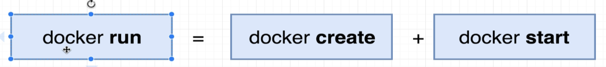

[back to previous file](../dockercontent.md)
---
# basic commands getting started with Docker

### 1. Creating and running a container from an Image
`docker run <image_name>`

- this `docker run` command is composed of two different commands:
- `docker create <image_name>` : create a container from image - outputs the container_ID
- `docker start -a <cotainer_id` : run/execute the container already created, -a flag makes docker attach to that running container and watch for output\

---

### 2. overwrite the default startup command in the Image
`docker run <image_name> <command instead of default one>`\
for this to run successfully the image should have the command executables in its FS snapshot, ls/echo... commands have executables that do the work once these commands run\

---

### 3. List all **running containers**
`docker ps`\

- `dockre ps --all` -> will list all the containers we have created till now **(not just the currently ones)**