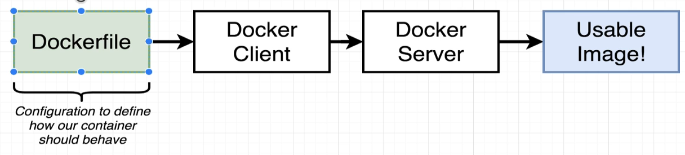
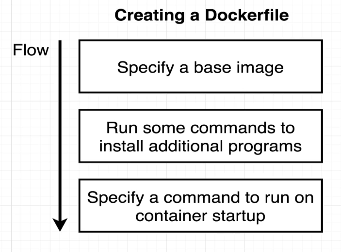

[back to previous file](../dockercontent.md)
---
# What is Dockerfile


### Dockerfile
It’s a plain text file that contains a series of instructions that the Docker daemon(server) follows step by step to build an image. Think of it as your blueprint for constructing a containerized application.




Here’s how it works:\
Instructions in Sequence:\
When you execute the docker build command, Docker reads the Dockerfile line by line, executing each instruction in the order they appear.\
These instructions define everything needed to set up your application environment within the image.



Common Instructions:
Let’s peek at some common instructions you’ll find in a Dockerfile:
- FROM: The first instruction—it specifies the base image you’re building upon. Every Dockerfile starts with this. For example, FROM ubuntu:20.04.
- RUN: Execute commands during the build process. Install packages, set up dependencies, etc.
- COPY and ADD: Copy files from your local machine into the image.
- ENV: Set environment variables.
- EXPOSE: Declare which ports your application listens on.
- CMD and ENTRYPOINT: Define the default command to run when a container starts.

Layered Approach:\
Docker builds images in layers. Each instruction in the Dockerfile creates a new layer.\
Layers are cached, so if you change one instruction, only the subsequent layers need rebuilding.\
This layering makes image creation efficient and allows for easy sharing of common layers across different images.

Example Dockerfile:

```
#Use an official Python base image
FROM python:3.9

# Set the working directory
WORKDIR /app

# Copy the current directory contents into the container
COPY . .

# Install any needed dependencies
RUN pip install -r requirements.txt

# Specify the command to run when the container starts
CMD ["python", "app.py"]
```

Building the Image:
Run `docker build -t myapp .` in the same directory as your Dockerfile.
Docker will execute the instructions, create layers, and produce an image tagged as myapp.

- new versions of docker-desktop have buildkit enabled by default that create `sha` based image IDs, where the real image ID value id followed by colon after the sha e.g. `sha:image_ID`


Running a Container:\
Once you have the image, you can spin up containers from it using docker run.\
The container inherits everything from the image, including the environment and the default command.