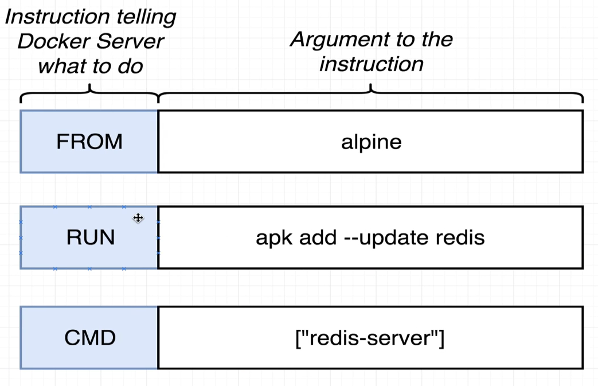
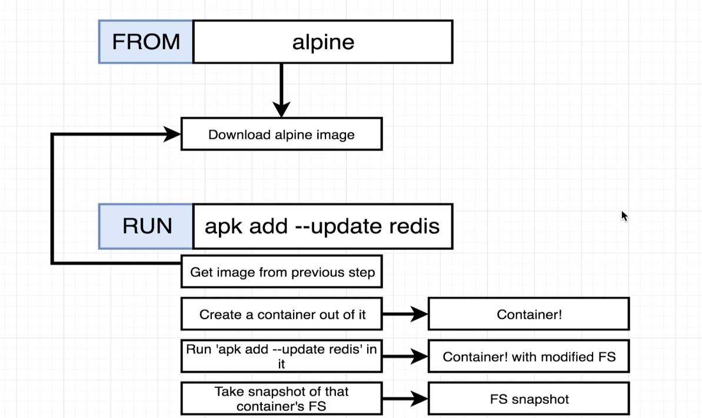
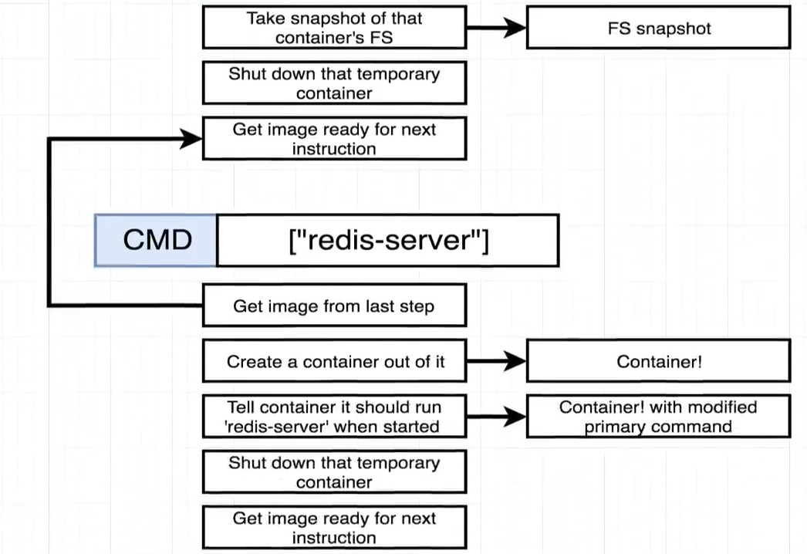
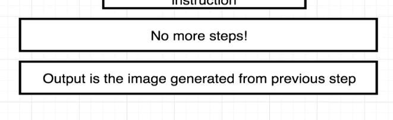

[back to previous file](../dockercontent.md)

---

# Dockerfile flow

### creating a dockerfile

writing a docker file is like 

name used for a dockerfile is `Dockerfile`\
then use instructions  (generally in all caps, single words) - RUN/FROM/CMD...\
these are executed in order to finally create an image 

- order of things for the given example:
   1. `FROM alpine` this uses a light-weight image with alpine linux OS as base
   2. `RUN <command>` this will run a given command while creating the image, generally to install some dependency
   3. `CMD ["command"]` will be the startup command for this image's containers
- once done with the docker file - move to the directory cotaining it in terminal and execute following command to build and generate image_ID `docker build .`
- then use the image_id from the output of the above command and start a container using `docker run <image_ID>` 

---
 
### `docker build .` details
- the first instruction provided a base image
- next command executed on a temporary container from previous instruction, the temporary container got some update due to current instruction and on completion this container used to create an intermediate image for next instruction in the flow
- next instruction runs on intermedate container from previous one's output and so on till the last instruction output generated - that is the final image created using your docker file

* Docker uses caching in between these steps to increase efficiency\
eg. - if your build instructions remains same, docker will re use previously created intermediate images during the current build process
* unless the order gets updated or some intermediate step gets updated values, docker will not re do the download and installations for the intermediate steps, save on the work done and get things build faster

