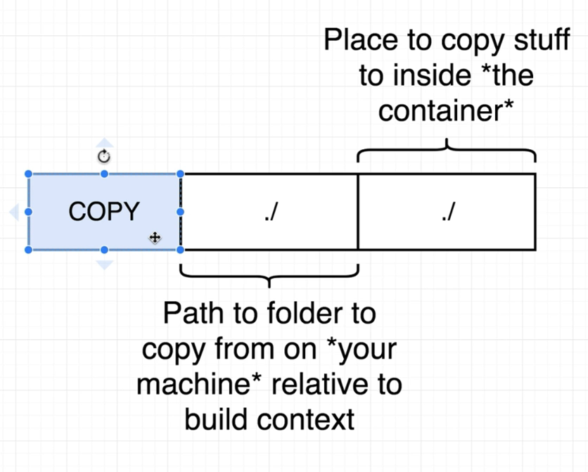
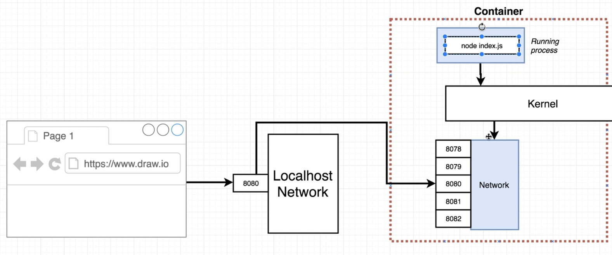
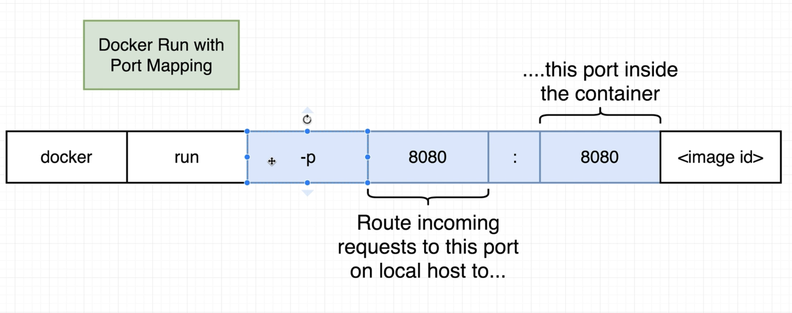
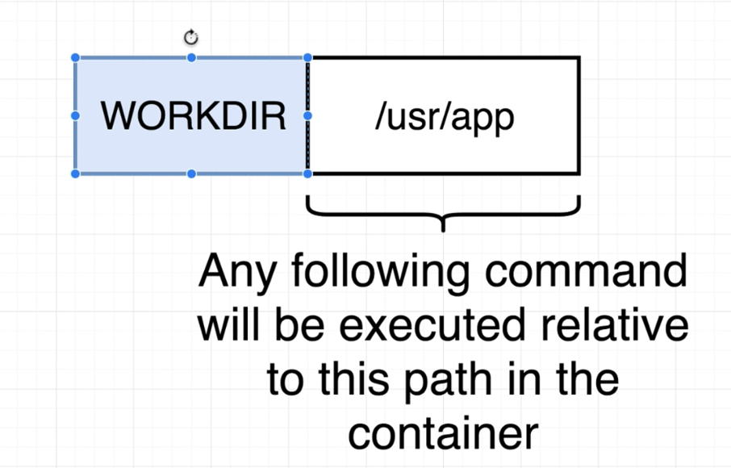

[back to previous file](../dockercontent.md)

---

# Real-World docker project - node server

### Dockerfile for creating container with node server

what we created : a simple node server that return a `hi` message at the base url, when accessed

this is the Dockcerfile we create to run our simple web server in container

```
# use some image that comes with node and npm pre-installed
# anything with `alpine` in the image name in docker means : the lightest images possible with minimal features/tools

FROM node:14-alpine 

# copy files in the current directory inside the supplied build context as part of the dockre build command
# copy them from current directory to the current directory of temp container that runs this instructions
# that way your npm install command has a package.json file to execute

COPY ./ ./

# exdecute npm install and install required dependencies

RUN npm install

# default startup command for the final image created, will start the node server on startup

CMD ["npm", "start"]
```



---

### port mapping for incoming requests

now your build goes successfully and image gets creted -> you start the cntainer that starts a server on container's port 8080

- some networking concepts for container 
- when your container wants to connect to outside world it can do so effortlessly
- when outside world wants to access some port on your container it first comes to your PC -> where if you do port mapping -> the request goes to port on the container 




- to achieve this you supply a flag to the docker-run command
`docker run -p port_on_pc:port_on_container <image_id>`, the ports need not to be same/identical ones


---

### workdir instruction in dockerfile

you can specify the working directory of the container when executing the commandds/programs 
- `WORKDIR` instuction in the Dockerfile does this 
- use this instruction right after the `FROM` instruction in order to set the working directory before any commands get executed in the container
- this is done to isolate your project files from container Files that may cause some issues of file overwrites due to similar names down the line



dockerfile becomes this :
```
FROM node:14-alpine 

WORKDIR /usr/app

COPY ./ ./

RUN npm install

CMD ["npm", "start"]
```
---

### performance increment by using caching properly

till now we have the copy instruction before the npm install instruction\
what this does is that for any changes in any one of your project files - the copy instruction will run again and subsequent steps will not use cache from previous builds\
this will cause unnecessary cache invalidation even though nothing changes for the installed dependencies\
solution :
1. Use the copy first to copy package.json file that `npm install` uses for dependency installation
2. RUN npm install
3. copy rest of the code over - now your code changes will not affect the expensive `npm install` step : resulting in computation savings 

```
FROM node:14-alpine 

WORKDIR /usr/app

COPY ./package.json ./

RUN npm install

COPY ./ ./

CMD ["npm", "start"]
```