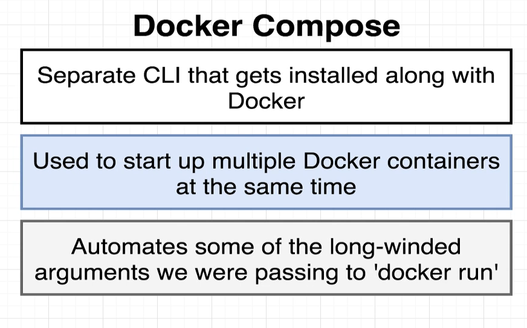
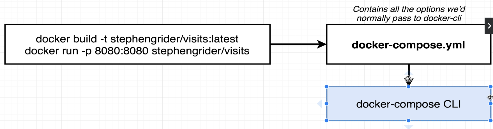
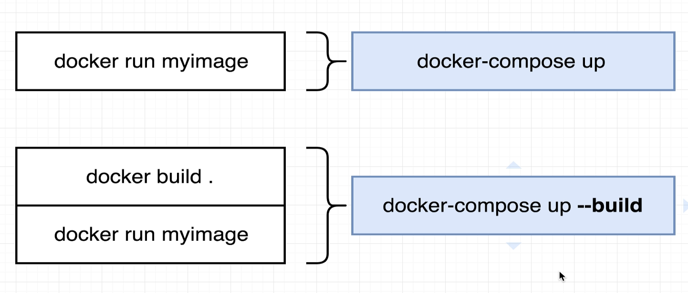

[back to previous page](../dockercontent.md)

--- 

# Docker Compose


### what/why docker compose


instead of manually passing different flags to the run comman to connect multiple containers, we use docker-compose

compose use yaml config file to get the job done



example docker-compose file
```
version: '3'
##version of docker-compose to be used
services:
##think of one service as a single type of containerised app, multiple defined in here
  redis-server:
  ##first kinf of service nameredis-server, will store the visitor count value
    image: 'redis'
    ##build using the redis image from the hub
  node-app:
  ##second service called node-app with the http server
    build: .
    ##look for build vonfig in the current directory, we got a dockerfile for this service already
    ports:
    ##port binding, local machine port 443 mapped to container port 8080
      - "443:8080"
```
--- 

### build using docker-compose

docker run VS docker-compose commands
