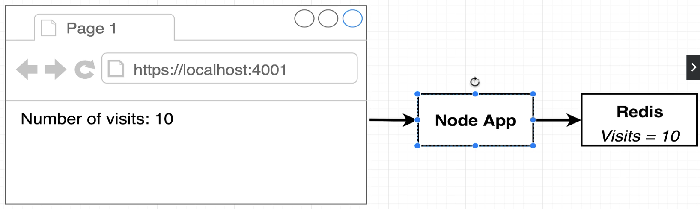
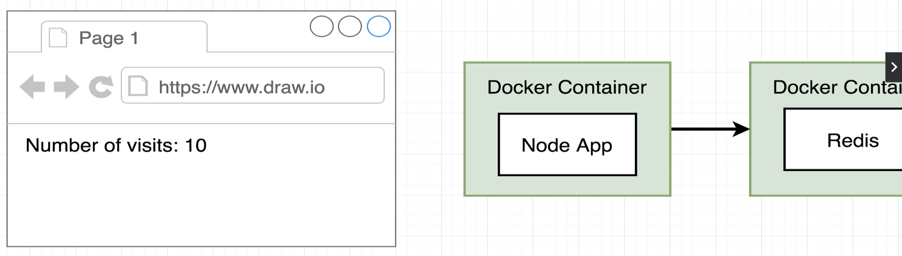

[back to previous file](../dockercontent.md)

---

# multi-container application example

- creating an application that display the count of visits that the web-page has had so far 

- you can save the count in the node application itself, but for the sake having multiple container we use redis in another container for saving the count value

---

### issues with multi-container apps : connectivity
how do you connect multiple containers with one another

- using the CLI, difficult and time consuming
- Docker-Compose, works out of the box : just ahve to defines multiple appllications/services as containers and compose takes care of running and coneecting them

