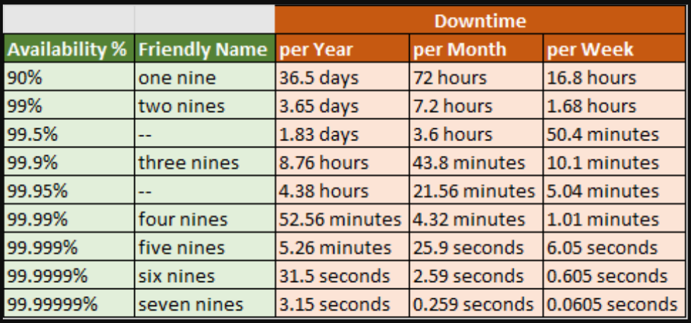

[back to previous page](./HLD.md)

---

# Back of the Enevelope Estimation

## Concepts for estimation

these are rough estimates created using a combination of thought experiments and common performance numbers, before you begin, following concepts should be well understood - 

- **power of 2** (memory and storage estimation)
   - KB(10^3 Bytes) -> MB(10^3 KB) -> GB(10^3 MB) -> TB(10^3 GB) -> PB(10^3 TB)

- **Latency numbers** (performance estimation & SLA requirements)
   - L1 cache access ---------------------- 0.5 ns (nano-sec)
   - L2 cache access ---------------------- 7 ns
   - Mutex lock/unlock -------------------- 25 ns
   - RAM access --------------------------- 100 ns
   - Compress 1K bytes with Zippy --------- 3 us (micro-sec)
   - Send 1K bytes over 1 Gbps network ---- 10 us
   - Read 1 MB sequentially from memory --- 250 us
   - Round trip within same datacenter ---- 500 us
   - Read 1 MB sequentially from SSD* ----- 1 ms (mili-sec)  ~1GB/sec SSD, 4X memory
   - Disk seek ---------------------------- 10 ms  (20x datacenter roundtrip)
   - Read 1 MB sequentially from disk ----- 20 ms  (80x memory, 20X SSD)
   - Send packet CA->Netherlands->CA  ----- 150 ms

- **Availability numbers** (SLA requirements)
   - 

## Tips for estimation process

Focus more on the process and less on correct answers, Solving more important than correct answer
- Round off and Approximate numbers, no one expects exact answers
- Write assumptions down for later reference
- Lebel Units
- Common asked estimation : QPS, RPS, Storage, Cache, Number of Servers...
   - QPS - Quries per sec (for DBs)
   - RPS - Requests per sec (for applicaiton serves) 

## practice question for estimation : 

**Q : Estimate QPS and Storage requriements for Twitter**
- Assumptions : 
   - Monthly Active Users (MAU) - 300 Million
   - 50% (MAU) use twitter daily - Daily Active Users (DAU) - 150 Million
   - Avg user post 2 tweets per day
   - 10% tweets cotnain Media
   - Data Stored for 5 Yrs

- Estimation : 
   - QPS :
      - DAU - 150 Million
      - Tweet QPS = (150 Million) * (2 tweets/day) / 24Hrs / 3600 Sec ~ **3500 QPS**
      - Peak QPS  = All at once -> 2*3500 = **7000 QPS**
   - Storage : 
      - Average tweet size - 
         - tweet_id : 8byte BIGINT -> capacity of 1.8X10^18 values (why this is enough for our usecase) ->
            - assuming 100% growth for next 5 years in user base and peak number of tweets -> ~ 36X10^12 tweets
         - text : 256 Byte (256 ASCII characters)
         - media : 5MB
      - Meadia Storage : 150 Million(DAU) * 2(avg users tweet count) * 5MB * 0.1 (only 10% tweets contain media) = 150X10^6 MB -> 150 TB per day
      - 5 Year media storage (assuming 100% YOY growth in user base) -> ~ 1700PB