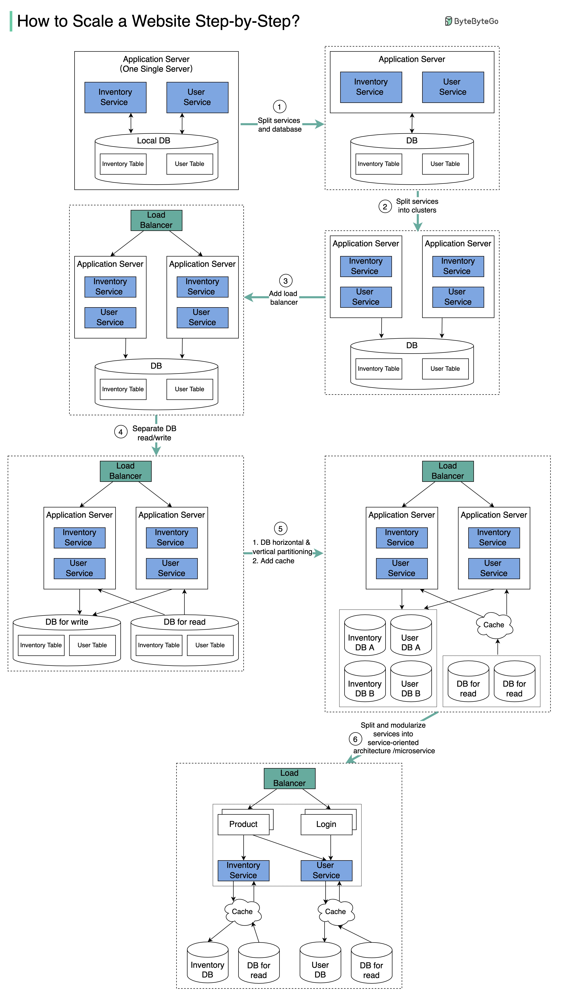
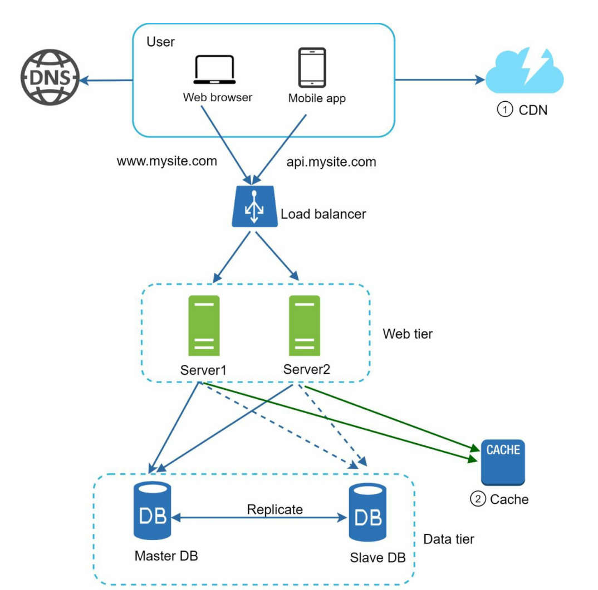
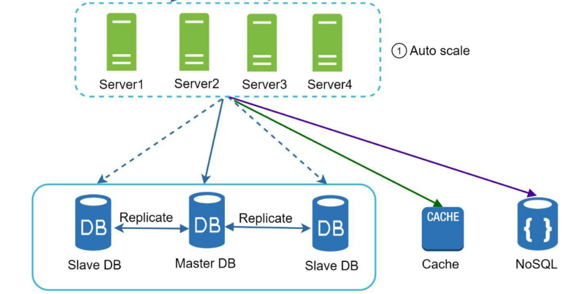
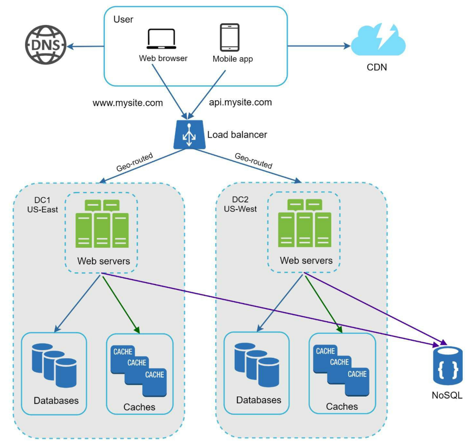

[back to previous page](./HLD.md)

---

# Scaling to Million Users

## Separate Web-layer and Data-layer 
Step 1 - With the growth of the user base, one single application server cannot handle the traffic anymore. We put the application server and the database server into two separate servers.

## Scale App servers and add Load-Balancer
Step 2 - The business continues to grow, and a single application server is no longer enough. So we deploy a cluster of application servers. 

Step 3 - Now the incoming requests have to be routed to multiple application servers, how can we ensure each application server gets an even load? The load balancer handles this nicely.

## DB replication : separate instances for Read/Write
Step 4 - With the business continuing to grow, the database might become the bottleneck. To mitigate this, we separate reads and writes in a way that frequent read queries go to read replicas. With this setup, the throughput for the database writes can be greatly increased.

## Cache Layer for performance
Step 5 - Suppose the business continues to grow. One single database cannot handle the load on both the inventory table and user table. We have a few options:

1. Vertical partition. Adding more power (CPU, RAM, etc.) to the database server. It has a hard limit.
2. Horizontal partition by adding more database servers.
3. Adding a caching layer to offload read requests.

## CDNs
Step 6 - A network of geographically dispersed edge servers to deliver cached static content (images, videos, CSS, JS...) 

Considerations for using Cache and CDNs:\
**Expiration Policy** - long duration for expiration might cause stale-data, opposite will cause frequent cache updates\
**Consistency** - keeping data and Cache/CDN in sync\
**Eviction policy** - once full, adding new item to cache will remove some existing one, some options (LRU-least recently used)/(LFU-least frequently used)/(FIFO)...

**CDN and Cache layers lighten load on the DB**

## StateLess Web-tier
Step 7 - We need to store user state somepalce to further make the web-tier stateless so that it can be scaled independently (auto-scale)

No-SQL DBs can help for this as this wont be relational data, but rather blob/document type

--- 

## Multi-DataCenter setup
step 8 - once we go international and have several million users, having multiple data-centers becomes crucial 

**Challanges** of this\
a. **traffic redirection** -> geo-DNS  can be used to redirect requests t the nearest data-center\
b. **Data Synchronistation** -> replicating data across multiple Data-centers and keeping it in sync (Couchbase DB offers XDCR feature for this)

## Further Scaling - message-queues
Step 9 - for further scaling we need to de-couple components of our system so that they can be scaled independently -> **Message-queue** is most commonly used to do this

Service-A : Message-Queue : Service-B

both these services can be scaled independent of each other, given they are loosely coupled (message queue helps with that)

## DB Horizontal Scaling - SHARDING

**Sharding** - separating large DB into smaller, more easily managed parts called SHARDS.Each Shard shares same schema, actual data on each shard is uinque to the shard.

**Sharding key** - aka partition key, consists of >=1 cols that determine how data is dsitributed, important that you choose a sharding key that ends up dsitributing data across shards evenly.

Challanges posed by Sharding : 
- **Resharding Data** - required when single shard size becomes too much and needs further division OR some shards experience too much traffic sue to un-even distribution. Needs updating sharding function and moving data around - **CONSISTENT HASHING** helps with this 

- **Celebrity Problem** - aka hotspot key problem, excessive access to a specific shard could cause server overload. Solution - allocate >=1 shard per celebrity as per the load

- **Join and de-normalization** - once sharded across multiple serves it is hard to perform join operations across DB shards. Common workaround is to de-normalize the DB 
   - *Consider a normalized database with two tables: students and branch. The students table has attributes roll_no, stud_name, age, and branch_id, while the branch table has attributes branch_id and branch_name. To retrieve student names along with their branch names, a join operation is required. In a denormalized database, the branch_name can be added directly to the students table, eliminating the need for a join*