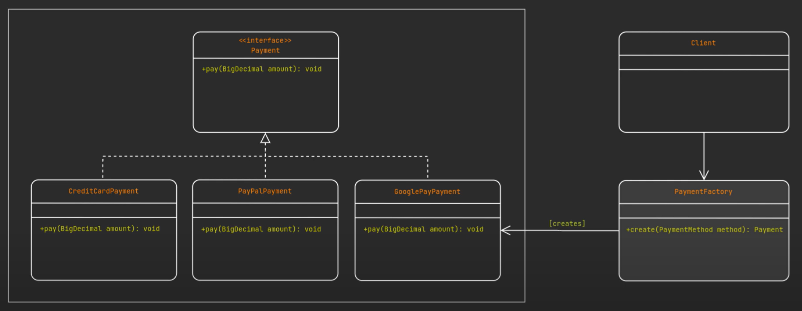

[back to previous page](../LLD.md)

---

## Factory Design Pattern

Create objects without exposing the creation logic to the client and refer to newly created object using a common interface,

the subclasses at runtime decide which class (that implemented the iterface) to instantiate

### when to use factory method :
  - class can not anticipate the class of objects it must create
  - class wants its subclass to specify the objects it creates
  - Classes delegate responsibility to one of several helper subclasses, and you want to localize the knowledge of which helper subclass is the delegate

### Major mplementation steps: 
  - Root interface/abstract-class
  - Concrete-implementation classes
  - FactoryMethod, returns class based on condition
  - sometimes Enums used to create switch statements(optional)




```
1.root interface

public interface Payment {
  void pay(BigInteger amount);
}

==============================================================================

2.concrete implementation classes

public class CreditCardPayment implements Payment{
  @Override
  public void pay(BigInteger amount) {
    System.out.println(MessageFormat.format("Successfully paid ${0} to merchant using a credit card", amount));
  }
} 
//similarly classes made for other implementations (Paypal, GooglePay, Applepay)

==============================================================================

3.factory class

public class PaymentFactory {
  public static Payment create(PaymentMethod paymentMethod) throws ClassNotFoundException {
    switch (paymentMethod) {
      case "CREDIT_CARD":
        return new CreditCardPayment();
      case "GOOGLE_PAY":
        return new GooglePayPayment();
      case "PAYPAL":
        return new PayPalPayment();
      default:
        throw new ClassNotFoundException(MessageFormat.format("${0} method not supported yet", paymentMethod));
    }
  }
}

==============================================================================

4 client code using pattern for payment logic

public static void main(String[] args){
  Payment payment = PaymentFactory.create("CREDIT_CARD");
  payment.pay(new BigInteger("98900"));
  Payment payment1 = PaymentFactory.create("GOOGLE_PAY");
  payment1.pay(new BigInteger("98900"));
  Payment payment2 = PaymentFactory.create("PAYPAL");
  payment2.pay(new BigInteger("98900"));
}


```